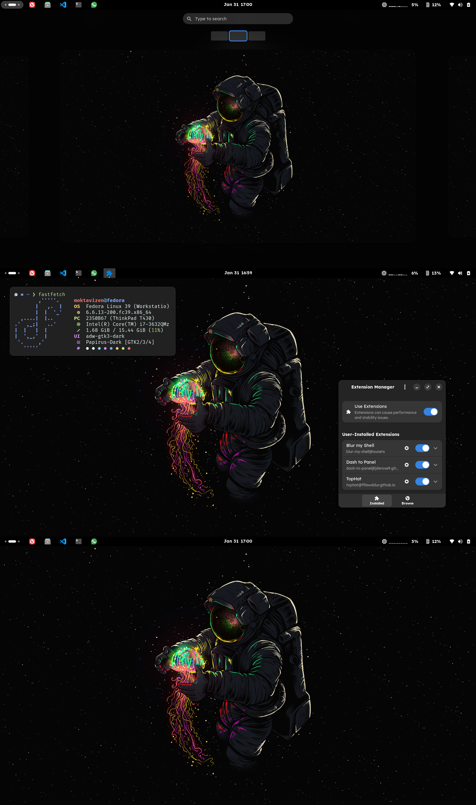

# GNOME Linux Dotfiles

Dotfiles for my Fedora Linux GNOME setup.

1. Wallpaper: [Jellyspace](wallpaper) by [angoes25](https://www.instagram.com/angoes25/)

2. GTK 4 Theme: Fedora GNOME default (Adwaita)

3. GTK 2/3 Theme: adw-gtk3-dark

4. Icons: Papirus Dark

5. GNOME Extension: 
   
   - Blur my Shell
   - [Dash to Panel](d2p-moktavizen)
   - TopHat

6. Terminal: Black Box

   - Color Scheme: [Material Darker](https://github.com/moktavizen/material-blackbox?tab=readme-ov-file#1-material-darker)
   
7. Shell: zsh

   - Theme: [powerlevel10k](.p10k.zsh)

8. Fonts:
   
   - UI Font: Lexend Regular 11
   - Terminal Font: Fira Code Nerd Font Mono Regular 12 

Preview:

